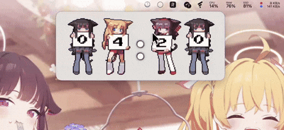

# NekoTime - 猫铃时钟

> 一个简单、可爱的桌面悬浮时钟

[](https://flutter.dev)
[](https://flutter.dev)
[](LICENSE)

<div align="center">
  
</div>

**NekoTime** 是一个跨平台的桌面悬浮时钟，支持 macOS、Windows 和 Linux。它拥有强大的主题系统，你可以像给游戏打 MOD 一样轻松定制属于自己的时钟样式。

> 📱 **注意**：本项目专注于桌面体验，不支持移动端（Android/iOS）。

## ✨ 特性

### 🎨 主题
- **无需编程** - 修改 JSON 配置即可，简单直观
- **素材丰富** - 支持 GIF 动画、图片、自定义字体和背景
- **即时预览** - 修改后点击重载，立马看到效果
- **开箱即用** - 内置多款精美主题

### 🪟 窗口控制
- **完全透明** - 支持系统级透明，不遮挡壁纸
- **毛玻璃** - 漂亮的背景模糊效果
- **分层管理** - 可以置顶，也可以沉浸在桌面上
- **自由拖拽** - 想放哪就放哪
- **锁定保护** - 防止手滑误触
- **透明度** - 随意调节透明度，双击还能隐藏

<div align="center">
  
  <p><em>透明度实时调节演示</em></p>
</div>

<div align="center">
  
  <p><em>窗口尺寸自由缩放</em></p>
</div>

### ⚡ 性能
- **轻量** - 占用极少系统资源
- **流畅** - 动画平滑，拒绝卡顿
- **智能** - 自动缓存资源，省电又省心

### 🌐 语言支持
- 支持简体中文和 English，自动切换

## 🚀 快速开始

### 环境要求

**通用要求**：
- **Flutter SDK** 3.0+
- 按照 [Flutter 官方文档](https://docs.flutter.dev/get-started/install) 配置对应平台开发环境

**平台特定依赖**：

<details>
<summary><b>macOS</b></summary>

- macOS 10.14 或更高版本
- Xcode 12.0 或更高版本
- CocoaPods

```bash
# 安装 CocoaPods（如未安装）
sudo gem install cocoapods
```
</details>

<details>
<summary><b>Windows</b></summary>

- Windows 10 1809 或更高版本（建议 Windows 10 1903+ 以获得最佳透明效果）
- Visual Studio 2019 或更高版本（包含 C++ 桌面开发工具）
- 启用开发者模式
</details>

<details>
<summary><b>Linux</b></summary>

#### 下载运行版（推荐）

从 [Releases](https://github.com/zoidberg-xgd/NekoTime/releases) 下载最新版本后：

```bash
# 1. 解压
tar -xzf NekoTime-Linux-x64-v*.tar.gz
cd NekoTime-Linux-x64-*

# 2. 安装运行时依赖（首次运行必需）
sudo ./scripts/install_linux_deps.sh

# 3. 启动应用
./run_linux.sh
```

#### 从源码构建

**Ubuntu/Debian**：
```bash
sudo apt-get update
sudo apt-get install -y \
    clang cmake ninja-build pkg-config \
    libgtk-3-dev liblzma-dev \
    libayatana-appindicator3-dev
```

**Fedora**：
```bash
sudo dnf install -y \
    clang cmake ninja-build \
    gtk3-devel lzma-devel \
    libayatana-appindicator-gtk3-devel
```

**Arch Linux**：
```bash
sudo pacman -S base-devel gtk3 cmake ninja
```

#### 常见问题

⚠️ **黑屏或 "No rendering surface available"**
```bash
# 运行依赖安装脚本
sudo ./scripts/install_linux_deps.sh

# 或手动安装运行时库
sudo apt install libgtk-3-0 libegl1 libgl1 libgles2
```
</details>

### 运行应用

```bash
# 克隆项目
git clone https://github.com/zoidberg-xgd/NekoTime.git
cd NekoTime

# 安装依赖
flutter pub get

# 运行 (macOS 示例)
flutter run -d macos

# 构建发行版
flutter build macos --release
```

构建产物位置：
- **macOS**: `build/macos/Build/Products/Release/NekoTime.app`
- **Windows**: `build/windows/x64/runner/Release/`
- **Linux**: `build/linux/x64/release/bundle/`

📘 **跨平台支持详情**：查看 [PLATFORM_SUPPORT.md](PLATFORM_SUPPORT.md) 了解各平台的详细构建和部署说明。

## 📖 使用指南

### 基础操作

| 操作 | 说明 |
|------|------|
| **拖动** | 鼠标按住时钟任意位置拖动（需解锁状态）|
| **隐藏** | 双击时钟窗口 / 托盘菜单选择"隐藏" |
| **显示** | 点击托盘图标 🕐 选择"显示" |
| **设置** | 右键托盘图标，选择"Settings" |

### 托盘菜单功能

- **Theme** - 快速切换已安装主题
- **Layer** - 窗口分层（Desktop / Normal / Top）
- **Scale** - 缩放倍数（0.75x ~ 2.0x）
- **Opacity** - 透明度滑块（10% ~ 100%）
- **Lock Position** - 锁定/解锁窗口位置
- **Settings** - 打开设置对话框
- **Reload Themes** - 重新加载主题列表
- **Quit** - 退出应用

### 设置对话框

- 查看当前配置
- 访问日志查看器（查看应用运行日志）
- 打开主题文件夹
- 一键打开日志目录

## 🎨 主题系统

### 主题目录位置

主题存储在应用支持目录的 `themes/` 文件夹。**建议从设置对话框底部复制完整路径**。

| 平台 | 路径 |
|------|------|
| **macOS (Sandbox)** | `~/Library/Containers/com.nekotime.app/Data/Library/Application Support/com.nekotime.app/themes/` |
| **macOS (非 Sandbox)** | `~/Library/Application Support/NekoTime/themes/` |
| **Windows** | `%APPDATA%\com.nekotime.app\themes\` |
| **Linux** | `~/.local/share/com.nekotime.app/themes/` |

> **注意**：从 DMG 或 App Store 安装的 macOS 版本使用 Sandbox 模式，路径较长。

### 创建主题

#### 1. 目录结构

```
themes/
└── my_awesome_theme/          # 主题文件夹（ID）
    ├── theme.json             # 主题配置（必需）
    ├── digits/                # 数字图片文件夹
    │   ├── 0.gif
    │   ├── 1.gif
    │   ├── ...
    │   └── 9.gif
    └── assets/                # 其他资源（可选）
        ├── background.jpg
        ├── overlay.png
        └── CustomFont.ttf
```

#### 2. 配置示例 (`theme.json`)

```json
{
  "id": "my_awesome_theme",
  "name": "My Awesome Theme",
  "version": "1.0.0",
  "apiVersion": 1,
  "kind": "blur",
  "borderRadius": 12,
  "padding": {
    "preset": "compact"
  },
  "layout": {
    "alignment": "center"
  },
  "backgroundColor": "#202020",
  "backgroundOpacityMultiplier": 0.5,
  "tintColor": "#9E9E9E",
  "tintOpacityMultiplier": 0.15,
  "blur": {
    "sigmaX": 16,
    "sigmaY": 16
  },
  "digit": {
    "spacing": 2,
    "gifPath": "digits",
    "format": "gif"
  }
}
```

#### 3. 配置字段说明

**基础信息**
- `id` - 主题唯一标识符（建议与文件夹名一致）
- `name` - 显示名称
- `version` - 主题版本号
- `apiVersion` - API 版本（当前为 1）

**外观样式**
- `kind` - 主题类型：`transparent` | `blur` | `solid`
- `borderRadius` - 边框圆角半径（像素）
- `backgroundColor` - 背景颜色（十六进制）
- `backgroundOpacityMultiplier` - 背景不透明度系数（0.0-1.0）
- `tintColor` - 着色颜色
- `tintOpacityMultiplier` - 着色不透明度系数

**布局配置**
- `padding.preset` - 内边距预设：`none` | `compact` | `cozy` | `comfortable`
- `padding.horizontal/vertical` - 自定义水平/垂直内边距
- `layout.alignment` - 对齐方式：`left` | `center` | `right`

**数字显示**
- `digit.spacing` - 数字间距（像素）
  - 推荐值：紧凑 `0-2` / 标准 `4-8` / 宽松 `10-16`
- `digit.gifPath` - 数字图片文件夹路径（相对主题根目录）
- `digit.format` - 图片格式：`gif` | `png` | `jpg` | `webp` | `bmp`
  - 留空则自动检测

**高级选项**
- `blur.sigmaX/sigmaY` - 模糊程度（仅 `kind: blur` 生效）
- `backgroundImage` - 背景图路径（相对主题根目录）
- `overlayImage` - 前景叠加图路径
- `fontFamily` - 自定义字体族名
- `fonts` - 字体文件路径数组（TTF/OTF）

### 快速配置模板

**极简紧凑**
```json
{
  "borderRadius": 12,
  "padding": { "preset": "compact" },
  "digit": { "spacing": 0 }
}
```

**毛玻璃效果**
```json
{
  "kind": "blur",
  "blur": { "sigmaX": 16, "sigmaY": 16 },
  "tintOpacityMultiplier": 0.15
}
```

### 应用主题

1. 将主题文件夹复制到 `themes/` 目录
2. 打开托盘菜单 → 点击 **"Reload Themes"**
3. 托盘菜单 → **Theme** → 选择你的主题

📚 **详细主题开发指南**：[themes/THEME_GUIDE.md](themes/THEME_GUIDE.md)

## 🛠 技术栈

| 组件 | 说明 |
|------|------|
| **Flutter** | 跨平台 UI 框架 |
| **flutter_acrylic** | 窗口毛玻璃和透明效果 |
| **window_manager** | 跨平台窗口管理 |
| **system_tray** | 系统托盘图标和菜单 |
| **provider** | 状态管理 |
| **shared_preferences** | 配置持久化 |
| **path_provider** | 文件路径访问 |

## 📝 更新日志

### v2.1.0 (2025-11-18)

**🐛 关键 Bug 修复**
- 修复应用卡死/无响应问题（移除性能瓶颈）
- 移除每秒触发的大量调试日志
- 优化窗口属性更新逻辑（仅在配置变更时执行）

**⚡ 性能优化**
- 减少 UI 重建次数
- 智能缓存窗口配置状态
- 降低主线程负载

### v2.0.0

**🎉 重大更新**
- 修复主题切换后数字消失问题
- 优化显示紧凑度（减少 20%-75% 留白）
- 添加完整日志系统（文件日志 + 应用内查看器）
- 支持多格式数字图片（GIF/PNG/JPG/WebP/BMP）
- 新增双击隐藏功能
- 托盘菜单快速显示/隐藏
- 完善主题开发文档

📋 **完整更新日志**：[CHANGELOG.md](CHANGELOG.md)

## 🧪 测试

NekoTime 包含完整的测试套件，确保代码质量和稳定性。

### 快速测试

```bash
# 运行所有测试
make test

# 快速测试（开发时）
make test-quick

# 生成覆盖率报告
make test-coverage
```

### 测试类型

- **单元测试** - 测试核心功能和服务
- **Widget 测试** - 测试 UI 组件
- **代码分析** - 静态代码检查
- **格式检查** - 代码风格验证

### 详细文档

- 📘 [测试指南](TESTING.md) - 完整的测试文档和最佳实践
- 🛠️ [工具脚本](tool/README.md) - 测试和构建脚本说明

## 🤝 贡献

欢迎提交 Issue 和 Pull Request！

### 开发规范
- 遵循 Flutter 官方代码风格
- 提交前运行 `make test` 或 `./tool/run_tests.sh`
- 确保所有测试通过
- 保持测试覆盖率 ≥ 70%
- 重大功能请先开 Issue 讨论

### 开发工作流

```bash
# 1. 克隆项目
git clone https://github.com/zoidberg-xgd/NekoTime.git
cd NekoTime

# 2. 获取依赖
make get

# 3. 运行测试
make test-quick

# 4. 运行应用
make run-macos  # 或 run-windows / run-linux

# 5. 提交前检查
make pre-release
```

## 📄 许可证

本项目采用 [MIT License](LICENSE) 开源协议。

---

<p align="center">
  <strong>NekoTime - 让时间更可爱 🐱⏰</strong>
</p>